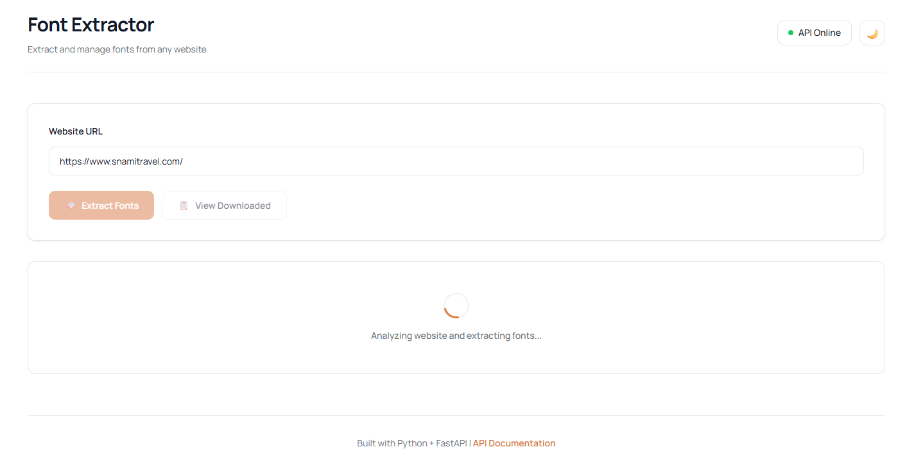
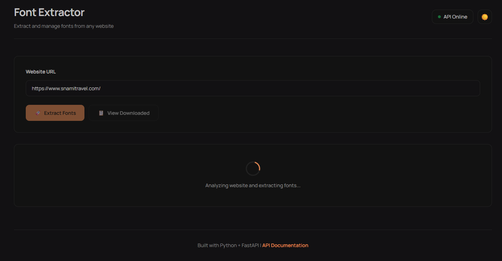
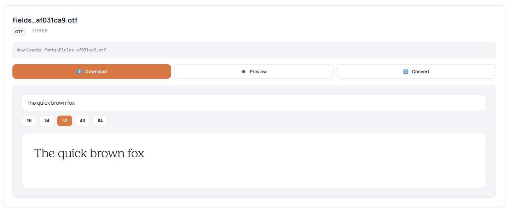
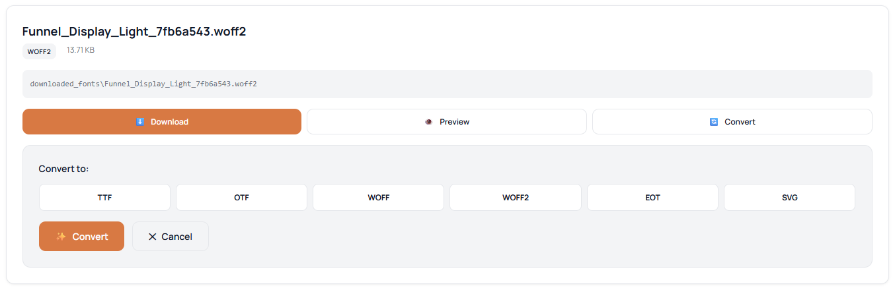

<div align="center">

# 🔤 Font Extractor

### Extract, preview and convert fonts from any website

[](https://www.python.org/)
[](https://fastapi.tiangolo.com/)
[](LICENSE)

A modern, professional tool to extract, preview, and convert web fonts with a beautiful minimalist UI.

[Features](#-features) • [Installation](#-installation) • [Usage](#-usage) • [API](#-api-documentation) • [Screenshots](#-screenshots)

</div>

---

## ✨ Features

### 🎯 Font Extraction
- **Complete CSS Analysis** - Extracts fonts from inline CSS, external stylesheets, and `@import` rules
- **Multiple Formats** - Supports WOFF, WOFF2, TTF, OTF, EOT, and SVG
- **Smart Detection** - Automatically finds all `@font-face` declarations
- **Duplicate Removal** - Intelligent deduplication based on URL hashing

### 🔄 Font Conversion
- **Format Conversion** - Convert between TTF, OTF, WOFF, WOFF2, EOT, and SVG
- **One-Click Download** - Instant download of converted fonts
- **Batch Processing** - Convert multiple fonts at once

### 👁️ Live Preview
- **Real-time Preview** - See fonts rendered immediately with custom text
- **Adjustable Sizes** - Preview at 16px, 24px, 32px, 48px, and 64px
- **Custom Text** - Type any text to preview the font style

### 🎨 Modern UI/UX
- **Minimalist Design** - Professional, clean interface using OKLCH color system
- **Dark/Light Mode** - Seamless theme switching with smooth transitions
- **Responsive** - Works perfectly on desktop, tablet, and mobile
- **Accessibility** - WCAG compliant with proper contrast ratios

---

## 🚀 Quick Start

### Prerequisites

- Python 3.13 or higher
- pip (Python package manager)

### Installation

1. **Clone the repository**
   ```bash
   git clone https://github.com/helderandre/font-extractor.git
   cd font-extractor
   ```

2. **Create a virtual environment** (recommended)
   ```bash
   python -m venv .venv
   
   # On Windows
   .venv\Scripts\activate
   
   # On macOS/Linux
   source .venv/bin/activate
   ```

3. **Install dependencies**
   ```bash
   pip install -r requirements.txt
   ```

### Running the Application

1. **Start the API server**
   ```bash
   python main.py
   ```
   
   The API will be running at `http://localhost:8000`

2. **Open the web interface**
   
   Open `index.html` in your browser, or simply double-click the file.

### Usage

1. **Enter a website URL** (e.g., `https://fonts.google.com`)
2. **Click "Extract Fonts"** to analyze and download fonts
3. **Preview fonts** with custom text and sizes
4. **Convert fonts** to different formats
5. **Download** fonts individually or all at once

Try these popular sites:
- [Google Fonts](https://fonts.google.com)
- [GitHub](https://github.com)
- [Apple](https://www.apple.com)
- [Stripe](https://stripe.com)

---

## 📚 API Documentation

The API provides RESTful endpoints for font extraction and management.

### Endpoints

#### `POST /download-fonts`
Extract and download fonts from a website.

**Request Body:**
```json
{
  "url": "https://example.com"
}
```

**Response:**
```json
{
  "success": true,
  "url": "https://example.com",
  "fonts_found": 5,
  "fonts_downloaded": 5,
  "fonts": [
    {
      "name": "Roboto",
      "format": "woff2",
      "url": "https://fonts.gstatic.com/...",
      "local_path": "downloaded_fonts/Roboto_a1b2c3d4.woff2"
    }
  ]
}
```

#### `GET /list-fonts`
List all downloaded fonts with metadata.

#### `POST /convert-font`
Convert a font to a different format.

**Request Body:**
```json
{
  "filename": "Roboto_a1b2c3d4.woff2",
  "target_format": "ttf"
}
```

#### `GET /supported-formats`
Get list of all supported font formats for conversion.

#### `GET /download-file/{filename}`
Download a specific font file.

#### `GET /download-converted/{filename}`
Download a converted font file.

#### `GET /docs`
Interactive API documentation (Swagger UI).

#### `GET /redoc`
Alternative API documentation (ReDoc).

### Interactive Documentation

Once the server is running, visit:
- **Swagger UI**: `http://localhost:8000/docs`
- **ReDoc**: `http://localhost:8000/redoc`

---

## 🏗️ Project Structure

```
font-extractor/
├── 📄 main.py                  # FastAPI backend application
├── 🌐 index.html               # Frontend web interface
├── 📋 requirements.txt         # Python dependencies
├── 📖 README.md                # Project documentation
├── 📁 downloaded_fonts/        # Downloaded fonts (auto-created)
├── 📁 converted_fonts/         # Converted fonts (auto-created)
└── 📁 .venv/                   # Virtual environment (optional)
```

---

## 🔧 Technology Stack

<table>
  <tr>
    <td align="center" width="96">
      
      <br>Python 3.13
    </td>
    <td align="center" width="96">
      
      <br>FastAPI
    </td>
    <td align="center" width="96">
      
      <br>HTML5
    </td>
    <td align="center" width="96">
      
      <br>CSS3
    </td>
    <td align="center" width="96">
      
      <br>JavaScript
    </td>
  </tr>
</table>

### Backend
- **[FastAPI](https://fastapi.tiangolo.com/)** - Modern, fast web framework for building APIs
- **[Uvicorn](https://www.uvicorn.org/)** - Lightning-fast ASGI server
- **[BeautifulSoup4](https://www.crummy.com/software/BeautifulSoup/)** - HTML/XML parser
- **[cssutils](https://github.com/jaraco/cssutils)** - CSS parser and manipulation
- **[fonttools](https://github.com/fonttools/fonttools)** - Font file manipulation library
- **[Brotli](https://github.com/google/brotli)** - Compression algorithm for WOFF2
- **[Requests](https://requests.readthedocs.io/)** - HTTP library

### Frontend
- **Vanilla JavaScript** - No frameworks, pure JS
- **OKLCH Color System** - Modern color space for better color management
- **Google Fonts (Manrope)** - Clean, professional typography
- **CSS Custom Properties** - Dynamic theming system

---

## 🔍 How It Works

1. **HTML Analysis** - The API fetches and parses the target website's HTML
2. **CSS Extraction** - Searches for inline CSS, external stylesheets, and `@import` rules
3. **Font-Face Parsing** - Uses cssutils to extract all `@font-face` declarations
4. **Smart Download** - Downloads each unique font with hash-based naming
5. **Local Storage** - Saves fonts in `downloaded_fonts/` directory
6. **Format Conversion** - Converts fonts using fonttools TTFont library
7. **Preview Generation** - Dynamically loads fonts with `@font-face` for live preview

---

## 📸 Screenshots

### Light Mode


### Dark Mode


### Font Preview


### Font Conversion


---

## 🤝 Contributing

Contributions are welcome! Here's how you can help:

1. Fork the repository
2. Create a feature branch (`git checkout -b feature/AmazingFeature`)
3. Commit your changes (`git commit -m 'Add some AmazingFeature'`)
4. Push to the branch (`git push origin feature/AmazingFeature`)
5. Open a Pull Request

### Development Setup

```bash
# Clone your fork
git clone https://github.com/helderandre/font-extractor.git

# Install dev dependencies
pip install -r requirements.txt

# Run tests (if available)
pytest

# Run with auto-reload
uvicorn main:app --reload
```

---

## ⚠️ Important Notes

- **CORS**: The API has CORS enabled for local development
- **Rate Limiting**: Some websites may block automated requests
- **Legal**: Respect font licenses and copyright when downloading
- **Storage**: Fonts are stored locally; clean up periodically
- **Formats**: Not all conversion combinations are supported
- **Browser Compatibility**: Best viewed in modern browsers (Chrome, Firefox, Edge, Safari)

---

## 🐛 Known Issues

- Some websites with heavy JavaScript may not load fonts properly
- Very large font files may take time to convert
- Some exotic font formats may not be supported

---

## 🗺️ Roadmap

- [ ] Add batch URL processing
- [ ] Implement font subsetting
- [ ] Add font comparison tool
- [ ] Support for variable fonts
- [ ] Font family grouping
- [ ] Export as ZIP archive
- [ ] Docker containerization
- [ ] Font metadata extraction (designer, license, etc.)

---

## 📝 License

This project is licensed under the MIT License - see the [LICENSE](LICENSE) file for details.

```
MIT License

Copyright (c) 2026 Font Extractor

Permission is hereby granted, free of charge, to any person obtaining a copy
of this software and associated documentation files (the "Software"), to deal
in the Software without restriction, including without limitation the rights
to use, copy, modify, merge, publish, distribute, sublicense, and/or sell
copies of the Software, and to permit persons to whom the Software is
furnished to do so, subject to the following conditions:

The above copyright notice and this permission notice shall be included in all
copies or substantial portions of the Software.

THE SOFTWARE IS PROVIDED "AS IS", WITHOUT WARRANTY OF ANY KIND, EXPRESS OR
IMPLIED, INCLUDING BUT NOT LIMITED TO THE WARRANTIES OF MERCHANTABILITY,
FITNESS FOR A PARTICULAR PURPOSE AND NONINFRINGEMENT.
```

---

## 👤 Author

**Helder Andre**

- GitHub: [@helderandre](https://github.com/helderandre)

---

## 🙏 Acknowledgments

- [FastAPI](https://fastapi.tiangolo.com/) for the amazing framework
- [fonttools](https://github.com/fonttools/fonttools) for font manipulation
- [Google Fonts](https://fonts.google.com/) for the Manrope font
- All contributors and users of this project

---

## 💬 Support

If you have any questions or need help, please:

- Open an [issue](https://github.com/helderandre/font-extractor/issues)
- Start a [discussion](https://github.com/helderandre/font-extractor/discussions)

---

<div align="center">

### ⭐ Star this repository if you find it helpful!

Made with ❤️ and Python

[Report Bug](https://github.com/helderandre/font-extractor/issues) · [Request Feature](https://github.com/helderandre/font-extractor/issues) · [Documentation](https://github.com/helderandre/font-extractor/wiki)

</div>
